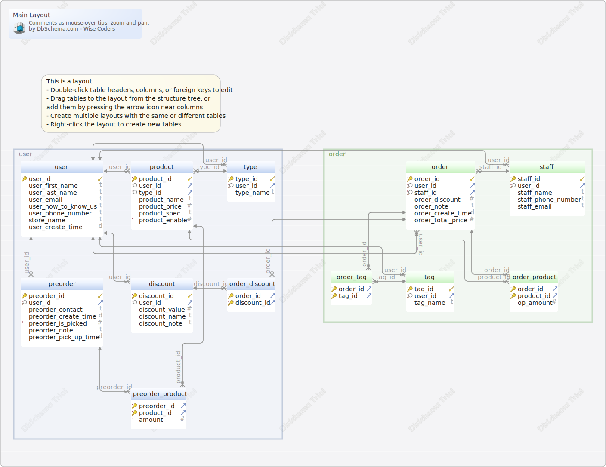

#Main Layout
Generated using [DbSchema](https://dbschema.com)

### Main Layout

## Tables

1. [ledger_schema.discount](#table-ledger\_schema.discount) 2. [ledger_schema.order](#table-ledger\_schema.order) 3. [ledger_schema.order_discount](#table-ledger\_schema.order\_discount) 4. [ledger_schema.order_product](#table-ledger\_schema.order\_product) 5. [ledger_schema.order_tag](#table-ledger\_schema.order\_tag) 6. [ledger_schema.preorder](#table-ledger\_schema.preorder) 7. [ledger_schema.preorder_product](#table-ledger\_schema.preorder\_product) 8. [ledger_schema.product](#table-ledger\_schema.product) 9. [ledger_schema.staff](#table-ledger\_schema.staff) 10. [ledger_schema.tag](#table-ledger\_schema.tag) 11. [ledger_schema.type](#table-ledger\_schema.type) 12. [ledger_schema.user](#table-ledger\_schema.user) 

### Table ledger_schema.discount 
| | | |
|---|---|---|
| * &#128273;  &#11019; | discount\_id| VARCHAR(45) COLLATE utf8mb4\_general\_ci |
| * &#128270; &#11016; | user\_id| VARCHAR(45) COLLATE utf8mb4\_general\_ci |
|  | discount\_value| INT  |
|  | discount\_name| VARCHAR(45) COLLATE utf8mb4\_general\_ci |
|  | discount\_note| VARCHAR(45) COLLATE utf8mb4\_general\_ci |

##### Indexes 
| | | |
|---|---|---|
| &#128273;  | pk\_discount | ON discount\_id|
| &#128270;  | user\_discount\_idx | ON user\_id|

##### Foreign Keys
| | | |
|---|---|---|
|  | user_discount | ( user\_id ) ref [ledger\_schema.user](#user) (user\_id) |

##### Options 
ENGINE=InnoDB DEFAULT CHARSET=utf8mb4 COLLATE=utf8mb4\_general\_ci 

### Table ledger_schema.order 
| | | |
|---|---|---|
| * &#128273;  &#11019; | order\_id| VARCHAR(45) COLLATE utf8mb4\_general\_ci |
| * &#128270; &#11016; | user\_id| VARCHAR(45) COLLATE utf8mb4\_general\_ci |
| * &#128270; &#11016; | staff\_id| VARCHAR(45) COLLATE utf8mb4\_general\_ci |
|  | order\_discount| INT  |
|  | order\_note| VARCHAR(60) COLLATE utf8mb4\_general\_ci |
|  | order\_create\_time| DATETIME  |
|  | order\_total\_price| INT  |

##### Indexes 
| | | |
|---|---|---|
| &#128273;  | pk\_order | ON order\_id|
| &#128270;  | user\_order\_idx | ON user\_id|
| &#128270;  | staff\_order\_idx | ON staff\_id|

##### Foreign Keys
| | | |
|---|---|---|
|  | staff_order | ( staff\_id ) ref [ledger\_schema.staff](#staff) (staff\_id) |
|  | user_order | ( user\_id ) ref [ledger\_schema.user](#user) (user\_id) |

##### Options 
ENGINE=InnoDB DEFAULT CHARSET=utf8mb4 COLLATE=utf8mb4\_general\_ci 

### Table ledger_schema.order_discount 
| | | |
|---|---|---|
| * &#128273;  &#11016; | order\_id| VARCHAR(45) COLLATE utf8mb4\_general\_ci |
| * &#128273;  &#11016; | discount\_id| VARCHAR(45) COLLATE utf8mb4\_general\_ci |

##### Indexes 
| | | |
|---|---|---|
| &#128273;  | pk\_order\_discount | ON order\_id, discount\_id|
| &#128270;  | order\_od\_idx | ON order\_id|
| &#128270;  | discount\_od | ON discount\_id|

##### Foreign Keys
| | | |
|---|---|---|
|  | discount_od | ( discount\_id ) ref [ledger\_schema.discount](#discount) (discount\_id) |
|  | order_od | ( order\_id ) ref [ledger\_schema.order](#order) (order\_id) |

##### Options 
ENGINE=InnoDB DEFAULT CHARSET=utf8mb4 COLLATE=utf8mb4\_general\_ci 

### Table ledger_schema.order_product 
| | | |
|---|---|---|
| * &#128273;  &#11016; | order\_id| VARCHAR(45) COLLATE utf8mb4\_general\_ci |
| * &#128273;  &#11016; | product\_id| VARCHAR(45) COLLATE utf8mb4\_general\_ci |
|  | op\_amount| INT  |

##### Indexes 
| | | |
|---|---|---|
| &#128273;  | pk\_order\_product | ON order\_id, product\_id|
| &#128270;  | product\_op\_idx | ON product\_id|

##### Foreign Keys
| | | |
|---|---|---|
|  | order_op | ( order\_id ) ref [ledger\_schema.order](#order) (order\_id) |
|  | product_op | ( product\_id ) ref [ledger\_schema.product](#product) (product\_id) |

##### Options 
ENGINE=InnoDB DEFAULT CHARSET=utf8mb4 COLLATE=utf8mb4\_general\_ci 

### Table ledger_schema.order_tag 
| | | |
|---|---|---|
| * &#128273;  &#11016; | order\_id| VARCHAR(45) COLLATE utf8mb4\_general\_ci |
| * &#128273;  &#11016; | tag\_id| VARCHAR(45) COLLATE utf8mb4\_general\_ci |

##### Indexes 
| | | |
|---|---|---|
| &#128273;  | pk\_order\_tag | ON order\_id, tag\_id|
| &#128270;  | tag\_ot\_idx | ON tag\_id|

##### Foreign Keys
| | | |
|---|---|---|
|  | order_ot | ( order\_id ) ref [ledger\_schema.order](#order) (order\_id) |
|  | tag_ot | ( tag\_id ) ref [ledger\_schema.tag](#tag) (tag\_id) |

##### Options 
ENGINE=InnoDB DEFAULT CHARSET=utf8mb4 COLLATE=utf8mb4\_general\_ci 

### Table ledger_schema.preorder 
| | | |
|---|---|---|
| * &#128273;  &#11019; | preorder\_id| VARCHAR(45) COLLATE utf8mb4\_general\_ci |
| * &#128270; &#11016; | user\_id| VARCHAR(45) COLLATE utf8mb4\_general\_ci |
|  | preorder\_contact| VARCHAR(45) COLLATE utf8mb4\_general\_ci |
|  | preorder\_create\_time| DATETIME  |
| * | preorder\_is\_picked| TINYINT  DEFAULT '0' |
|  | preorder\_note| VARCHAR(60) COLLATE utf8mb4\_general\_ci |
|  | preorder\_pick\_up\_time| DATETIME  |

##### Indexes 
| | | |
|---|---|---|
| &#128273;  | pk\_preorder | ON preorder\_id|
| &#128270;  | user\_preorder\_idx | ON user\_id|

##### Foreign Keys
| | | |
|---|---|---|
|  | user_preorder | ( user\_id ) ref [ledger\_schema.user](#user) (user\_id) |

##### Options 
ENGINE=InnoDB DEFAULT CHARSET=utf8mb4 COLLATE=utf8mb4\_general\_ci 

### Table ledger_schema.preorder_product 
| | | |
|---|---|---|
| * &#128273;  &#11016; | preorder\_id| VARCHAR(45) COLLATE utf8mb4\_general\_ci |
| * &#128273;  &#11016; | product\_id| VARCHAR(45) COLLATE utf8mb4\_general\_ci |
| * | amount| INT  |

##### Indexes 
| | | |
|---|---|---|
| &#128273;  | pk\_preorder\_product | ON preorder\_id, product\_id|
| &#128270;  | product\_pp\_idx | ON product\_id|

##### Foreign Keys
| | | |
|---|---|---|
|  | preorder_pp | ( preorder\_id ) ref [ledger\_schema.preorder](#preorder) (preorder\_id) |
|  | product_pp | ( product\_id ) ref [ledger\_schema.product](#product) (product\_id) |

##### Options 
ENGINE=InnoDB DEFAULT CHARSET=utf8mb4 COLLATE=utf8mb4\_general\_ci 

### Table ledger_schema.product 
| | | |
|---|---|---|
| * &#128273;  &#11019; | product\_id| VARCHAR(45) COLLATE utf8mb4\_general\_ci |
| * &#128270; &#11016; | user\_id| VARCHAR(45) COLLATE utf8mb4\_general\_ci |
| * &#128270; &#11016; | type\_id| VARCHAR(45) COLLATE utf8mb4\_general\_ci |
|  | product\_name| VARCHAR(45) COLLATE utf8mb4\_general\_ci |
|  | product\_price| INT  |
|  | product\_spec| VARCHAR(45) COLLATE utf8mb4\_general\_ci |
| * | product\_enable| TINYINT  DEFAULT '1' |

##### Indexes 
| | | |
|---|---|---|
| &#128273;  | pk\_product | ON product\_id|
| &#128270;  | user\_product\_idx | ON user\_id|
| &#128270;  | type\_product\_idx | ON type\_id|

##### Foreign Keys
| | | |
|---|---|---|
|  | type_product | ( type\_id ) ref [ledger\_schema.type](#type) (type\_id) |
|  | user_product | ( user\_id ) ref [ledger\_schema.user](#user) (user\_id) |

##### Options 
ENGINE=InnoDB DEFAULT CHARSET=utf8mb4 COLLATE=utf8mb4\_general\_ci 

### Table ledger_schema.staff 
| | | |
|---|---|---|
| * &#128273;  &#11019; | staff\_id| VARCHAR(45) COLLATE utf8mb4\_general\_ci |
| * &#128270; &#11016; | user\_id| VARCHAR(45) COLLATE utf8mb4\_general\_ci |
|  | staff\_name| VARCHAR(45) COLLATE utf8mb4\_general\_ci |
|  | staff\_phone\_number| VARCHAR(10) COLLATE utf8mb4\_general\_ci |
|  | staff\_email| VARCHAR(45) COLLATE utf8mb4\_general\_ci |

##### Indexes 
| | | |
|---|---|---|
| &#128273;  | pk\_staff | ON staff\_id|
| &#128270;  | user\_staff\_idx | ON user\_id|

##### Foreign Keys
| | | |
|---|---|---|
|  | user_staff | ( user\_id ) ref [ledger\_schema.user](#user) (user\_id) |

##### Options 
ENGINE=InnoDB DEFAULT CHARSET=utf8mb4 COLLATE=utf8mb4\_general\_ci 

### Table ledger_schema.tag 
| | | |
|---|---|---|
| * &#128273;  &#11019; | tag\_id| VARCHAR(45) COLLATE utf8mb4\_general\_ci |
| * &#128270; &#11016; | user\_id| VARCHAR(45) COLLATE utf8mb4\_general\_ci |
|  | tag\_name| VARCHAR(45) COLLATE utf8mb4\_general\_ci |

##### Indexes 
| | | |
|---|---|---|
| &#128273;  | pk\_tag | ON tag\_id|
| &#128270;  | user\_tag\_idx | ON user\_id|

##### Foreign Keys
| | | |
|---|---|---|
|  | user_tag | ( user\_id ) ref [ledger\_schema.user](#user) (user\_id) |

##### Options 
ENGINE=InnoDB DEFAULT CHARSET=utf8mb4 COLLATE=utf8mb4\_general\_ci 

### Table ledger_schema.type 
| | | |
|---|---|---|
| * &#128273;  &#11019; | type\_id| VARCHAR(45) COLLATE utf8mb4\_general\_ci |
| * &#128270; &#11016; | user\_id| VARCHAR(45) COLLATE utf8mb4\_general\_ci |
|  | type\_name| VARCHAR(45) COLLATE utf8mb4\_general\_ci |

##### Indexes 
| | | |
|---|---|---|
| &#128273;  | pk\_type | ON type\_id|
| &#128270;  | user\_type\_idx | ON user\_id|

##### Foreign Keys
| | | |
|---|---|---|
|  | user_type | ( user\_id ) ref [ledger\_schema.user](#user) (user\_id) |

##### Options 
ENGINE=InnoDB DEFAULT CHARSET=utf8mb4 COLLATE=utf8mb4\_general\_ci 

### Table ledger_schema.user 
| | | |
|---|---|---|
| * &#128273;  &#11019; | user\_id| VARCHAR(45) COLLATE utf8mb4\_general\_ci |
|  | user\_first\_name| VARCHAR(20) COLLATE utf8mb4\_general\_ci |
|  | user\_last\_name| VARCHAR(20) COLLATE utf8mb4\_general\_ci |
|  | user\_email| VARCHAR(45) COLLATE utf8mb4\_general\_ci |
|  | user\_how\_to\_know\_us| VARCHAR(45) COLLATE utf8mb4\_general\_ci |
|  | user\_phone\_number| VARCHAR(10) COLLATE utf8mb4\_general\_ci |
|  | store\_name| VARCHAR(50) COLLATE utf8mb4\_general\_ci |
|  | user\_create\_time| DATETIME  DEFAULT CURRENT_TIMESTAMP |

##### Indexes 
| | | |
|---|---|---|
| &#128273;  | pk\_user | ON user\_id|

##### Options 
ENGINE=InnoDB DEFAULT CHARSET=utf8mb4 COLLATE=utf8mb4\_general\_ci 

